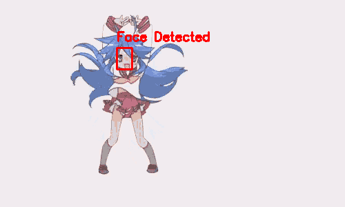

# Image Detection

`Image Detection` is a Python-based application for detecting and highlighting key objects in images and animated GIFs. It utilizes advanced edge detection, feature matching, and asynchronous processing to efficiently handle various file types, drawing bounding boxes around detected regions.


### Features:
- **Async Loading**: Efficiently loads and caches image data with asynchronous processing.
- **Edge Detection and Keypoints**: Uses ORB keypoints and FLANN-based matching for accurate feature detection.
- **GIF Support**: Processes GIF frames with bounding boxes and saves results as a new animated GIF.
- **URL Support**: Allows for loading images directly from URLs.
- **Progress Tracking**: Uses `tqdm` to display processing progress for GIF frames.

### Detected Face GIF



This GIF demonstrates the **face detection** functionality of the `ImagePredictor`. In the example, the application detects faces in animated GIFs frame by frame. Each frame is processed to identify the most prominent face using the `DNN-based face detector`. Once the face is detected, a bounding box is drawn around it to clearly highlight the identified region. 

**Key Steps:**
- **Face Detection**: The system uses OpenCV's deep learning-based face detector (Caffe model) to identify faces.
- **Landmark Refinement**: After detecting the face, the system refines the bounding box using facial landmarks to ensure a tight fit around the face.
- **GIF Processing**: The process works for both static images and GIFs, where each frame is processed independently, and the final output is saved as a new GIF.

The result is an animated GIF showing faces accurately detected and refined across multiple frames.

## Installation

1. Clone the repository:

   ```bash
   git clone https://github.com/cringe-neko-girl/detection.git
   cd Detection

