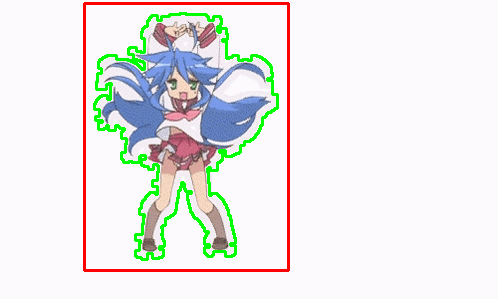

# ImagePredictor

`ImagePredictor` is a Python-based application for identifying the closest matching image from a dataset. It uses advanced edge detection, feature matching, and asynchronous processing to handle both static images and animated GIFs, identifying objects based on a precomputed dataset of features.



### Features:
- **Async Loading**: Efficiently loads and caches image data with asynchronous processing.
- **Edge Detection and Keypoints**: Uses ORB keypoints and FLANN-based matching for accurate feature matching.
- **GIF Support**: Processes GIF frames with bounding boxes and saves results as a new animated GIF.
- **URL Support**: Allows for loading images directly from URLs.
- **Progress Tracking**: Uses `tqdm` to display processing progress for GIF frames.
- **Face Detection**: Integrated with face detection using DNN models for accurate facial bounding box prediction.

### Detected Face GIF


This GIF demonstrates the **face detection** functionality of the `ImagePredictor`. In the example, the application detects faces in animated GIFs frame by frame. Each frame is processed to identify the most prominent face using the `DNN-based face detector`. Once the face is detected, a bounding box is drawn around the face to clearly highlight the identified region. 

Additionally, if landmarks are detected, they are used to refine the bounding box to ensure that the face is tightly cropped, excluding unnecessary areas like hair or background.

**Key Steps:**
- **Face Detection**: The system uses OpenCV's deep learning-based face detector (Caffe model) to detect faces.
- **Landmark Refinement**: After detecting the face, the system refines the bounding box using facial landmarks to make sure it fits tightly around the face.
- **GIF Processing**: The process works not only for static images but also for GIFs, where each frame is processed independently, and the final output is saved as a new GIF.

The result is an animated GIF showing faces accurately detected and refined across multiple frames.

## Installation

1. Clone the repository:

   ```bash
   git clone https://github.com/cringe-neko-girl/detection.git
   cd ImagePredictor
